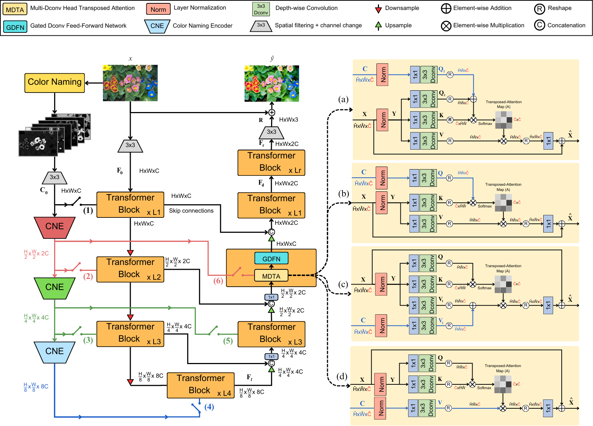
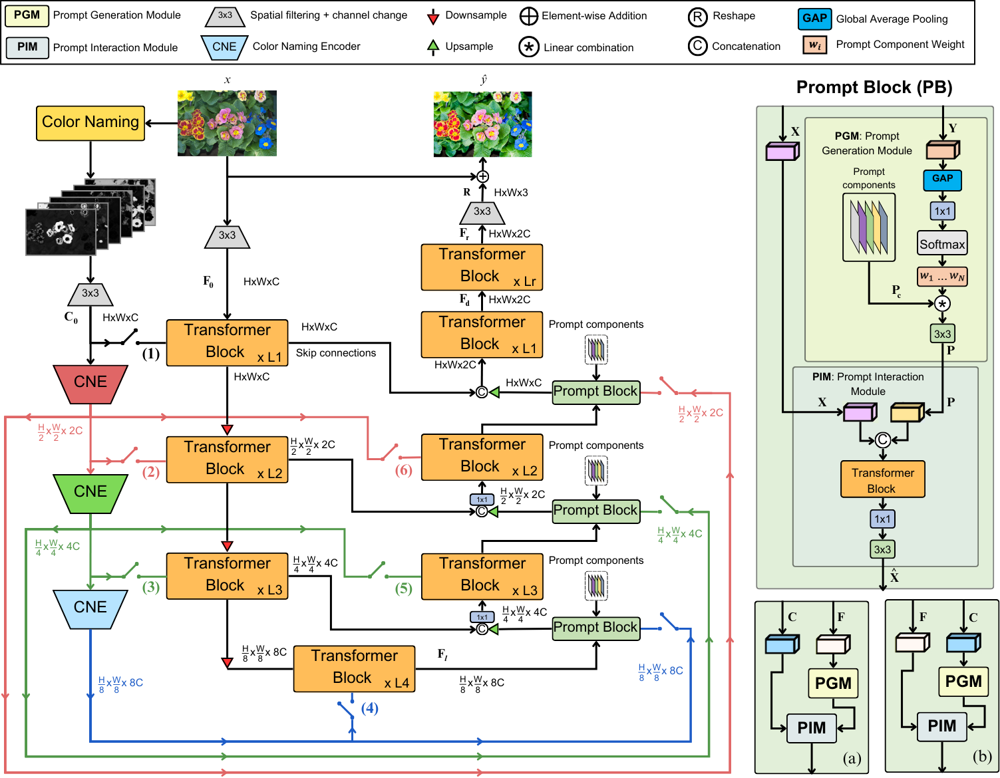

# Image Enhancement using Color Naming in Transformer-Based Models

<hr />

> **Abstract:** *Color naming, the process of categorizing colors into 
> universal terms, plays a significant role in how humans perceive and 
> describe images. Leveraging this concept, this thesis integrates color 
> naming probability maps into transformer-based models to enhance image 
> retouching. By embedding these maps into the deep learning pipeline of 
> models like Restormer and PromptIR, the study aims to replicate the 
> nuanced adjustments made by expert retouchers. The results demonstrate 
> that incorporating color naming improves color accuracy and visual 
> quality, providing a novel approach to automated image enhancement.* 
<hr />

## Overview

This repository contains the implementation of the methods proposed 
in the Master thesis titled **"Image Enhancement using Color Naming in 
Transformer-Based Models"**. The project integrates color naming 
probability maps into transformer-based models, Restormer and PromptIR,
to enhance the process of image retouching, focusing on replicating 
expert adjustments in color accuracy and overall visual quality. The 
report can be found [here](assets/Image%20Enhancement%20using%20Color%20Naming%20in%20Transformer-Based%20Models.pdf).

## Methods 

### Restormer with Color Naming (RCN)

The Restormer model is a transformer-based architecture originally 
designed for image restoration. In this work, we modify the Restormer 
pipeline to incorporate color naming probability maps. These maps are 
used to guide the model in replicating expert retouching styles by 
embedding color information within the transformer blocks. A Color 
Naming Encoder (CNE) is introduced to process these maps, which are 
integrated into the model's hierarchical structure to improve the 
model's performance in image enhancement tasks. The original MDTA module
is modified in four different ways, (a), (b), (c), and (d) in the 
image below, to include the color naming information in the attention
mechanism.



### PromptIR with Color Naming (PIRCN)

PromptIR is a variant of Restormer that includes a prompt block 
designed to incorporate additional information about image degradation.
In this project, we extend PromptIR by including color naming 
features within the prompt block, enabling the model to use this color 
information more effectively during the image enhancement process. 
The CNE is used here as well, and the resulting model demonstrates 
improved performance in replicating expert-level image retouching.
The MDTA module is also modified in the same four ways as in the RCN, 
and we also modified the prompt block to include the color naming
information. 



## Data

The experiments were conducted using the MIT-Adobe-5K dataset, 
a large dataset of 5,000 high-resolution images captured with 
DSLR cameras. Each image in the dataset has been retouched by 
five different professional photographers, providing a rich source 
of training data for learning image enhancement models. For our 
experiments, we used the version retouched by expert C, which has 
been widely recognized as producing the most visually appealing results.

The dataset was split into training, validation, and testing sets, 
with 3,500 images for training, 750 for validation, and 750 for 
testing. The images were pre-processed to match the requirements 
of the models, and the results were evaluated using metrics such 
as PSNR, SSIM, and color difference metrics (ΔE00 and ΔEab).

## Getting started

### Environment setup

Follow the steps below to set up the environment: 

1. Clone the repository:

```bash
git clone 
```

2. Make conda environment: 

```bash
conda create -n tfm_env python=3.10
conda activate tfm_env
```

3. Install the pytorch packages (follow the instructions in the [Pytorch website](https://pytorch.org/get-started/locally/)): 

```bash
conda install pytorch torchvision torchaudio pytorch-cuda=12.1 -c pytorch -c nvidia
```

4. Install the required packages: 

```bash
pip install matplotlib scikit-learn scikit-image opencv-python yacs joblib natsort h5py tqdm
pip install einops gdown addict future lmdb numpy pyyaml requests scipy tb-nightly yapf lpips
pip install torchmetrics pandas
```

### Training the models

To train the models, execute the train.py script and pass the configuration file as an argument. The configuration files can be found in the "config/train" directory. 

```bash
python train.py -opt config/train/baseline/Restormer_FiveK_baseline_official_split_2.yml
```

### Testing the models

To test the models, execute the test.py script and pass the configuration file as an argument. The configuration files can be found in the "config/test" directory. 

```bash
python test.py -opt config/test/Restormer_FiveK_baseline_official_split_2.yml
```


