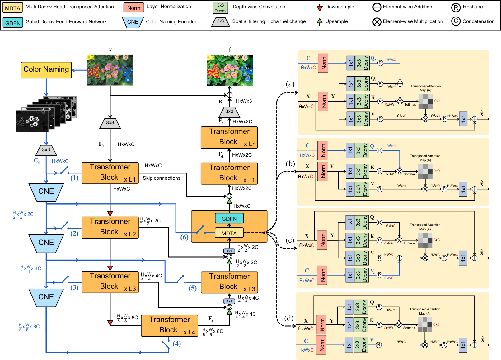
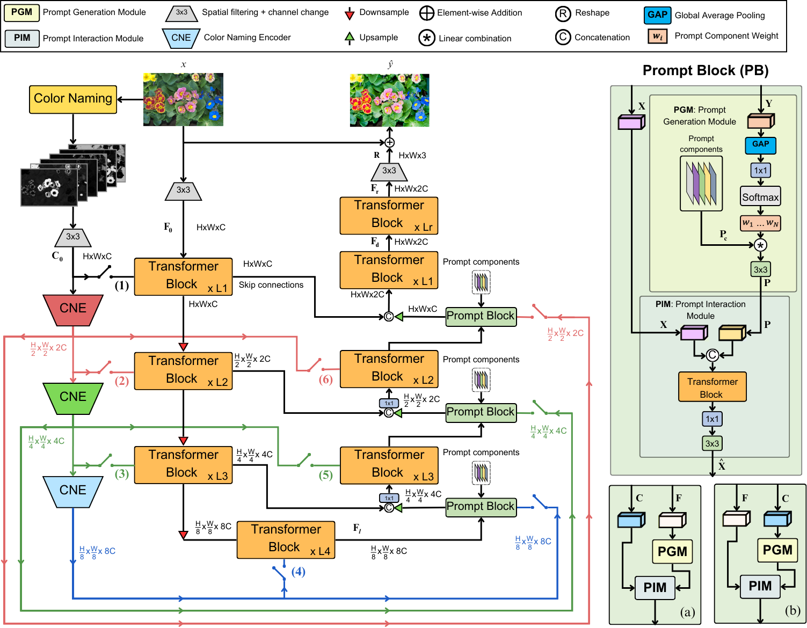

# Image Enhancement using Color Naming in Transformer-Based Models

## Overview

This repository contains the implementation of the methods proposed 
in the Master thesis titled **"Image Enhancement using Color Naming in 
Transformer-Based Models"**. The project integrates color naming 
probability maps into transformer-based models, Restormer and PromptIR,
to enhance the process of image retouching, focusing on replicating 
expert adjustments in color accuracy and overall visual quality.

## Methods 

### Restormer with Color Naming (RCN)

The Restormer model is a transformer-based architecture originally 
designed for image restoration. In this work, we modify the Restormer 
pipeline to incorporate color naming probability maps. These maps are 
used to guide the model in replicating expert retouching styles by 
embedding color information within the transformer blocks. A Color 
Naming Encoder (CNE) is introduced to process these maps, which are 
integrated into the model's hierarchical structure to improve the 
model's performance in image enhancement tasks. The original MDTA module
is modified in four different ways, (a), (b), (c), and (d) in the 
image below, to include the color naming information in the attention
mechanism.

### PromptIR with Color Naming (PCN)

PromptIR is a variant of Restormer that includes a prompt block 
designed to incorporate additional information about image degradation.
In this project, we extend PromptIR by including color naming 
features within the prompt block, enabling the model to use this color 
information more effectively during the image enhancement process. 
The CNE is used here as well, and the resulting model demonstrates 
improved performance in replicating expert-level image retouching.
The MDTA module is also modified in the same four ways as in the RCN, 
and we also modified the prompt block to include the color naming
information. 

## Data

The experiments were conducted using the MIT-Adobe-5K dataset, 
a large dataset of 5,000 high-resolution images captured with 
DSLR cameras. Each image in the dataset has been retouched by 
five different professional photographers, providing a rich source 
of training data for learning image enhancement models. For our 
experiments, we used the version retouched by expert C, which has 
been widely recognized as producing the most visually appealing results.

The dataset was split into training, validation, and testing sets, 
with 3,500 images for training, 750 for validation, and 750 for 
testing. The images were pre-processed to match the requirements 
of the models, and the results were evaluated using metrics such 
as PSNR, SSIM, and color difference metrics (ΔE00 and ΔEab).

## Getting started

### Environment setup

